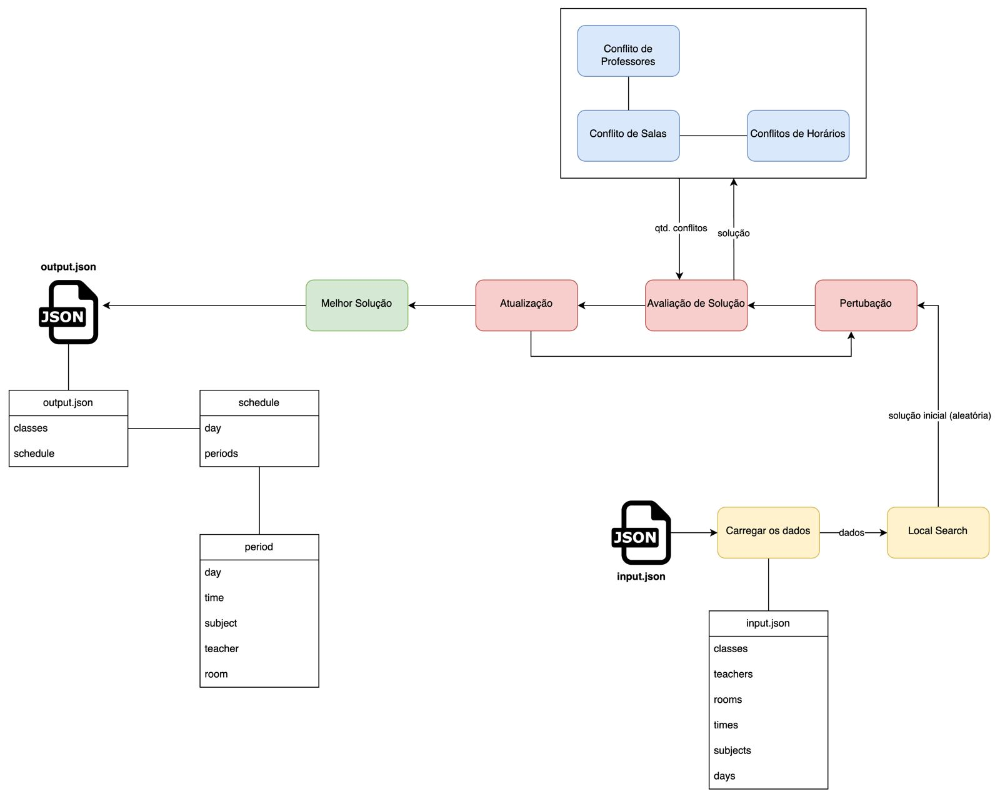

# Timetabling Implementation

## Rodar Front-End
```
cd front-timetabling
npm install
npm run dev
```

## Rodar Algoritmo de Busca Local
```
cd local-search-algorithm/src 
python3 main.py 
```

## Funcionamento Básico do Algoritmo
